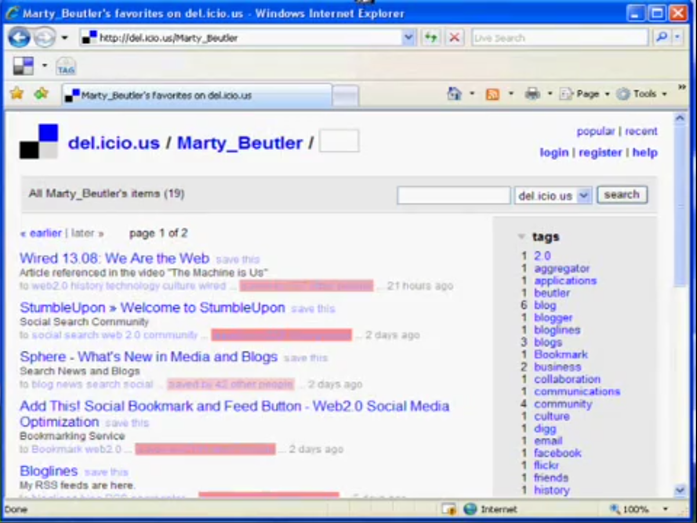
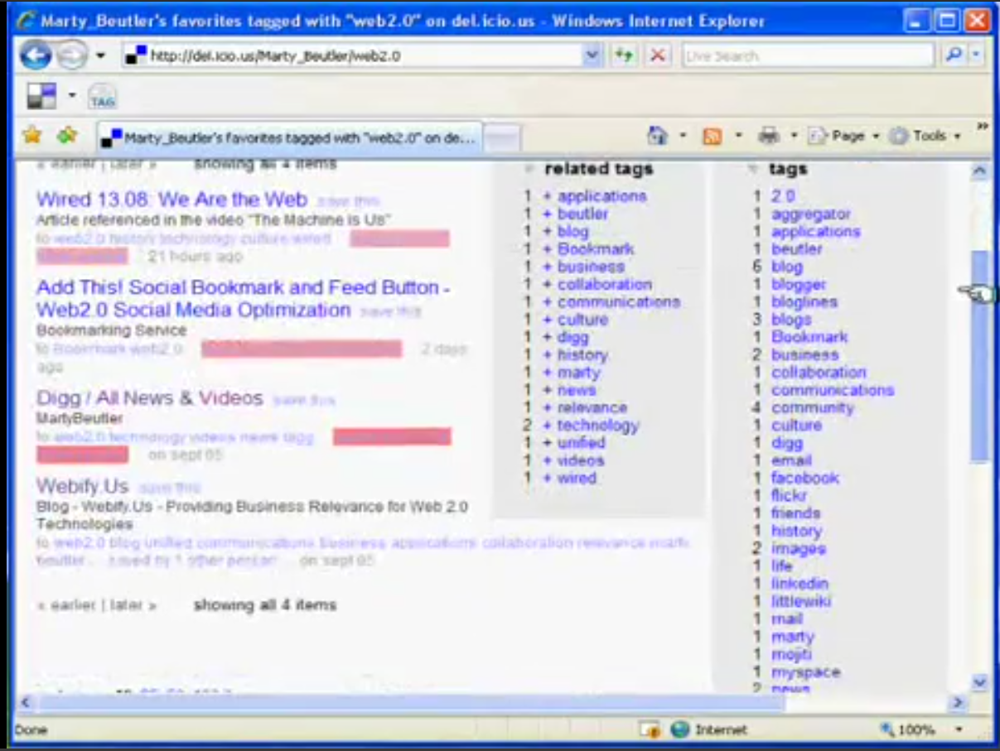
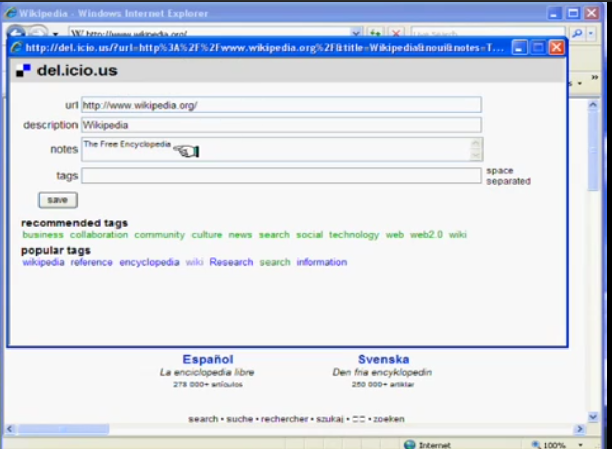

# yummy
a del.icio.us clone

## Getting Started 

```
virtualenv venv
source venv/bin/activate
pip3 install -r requirements.txt
pip3 install flask
python3 main.py
```

Then go to http://localhost:5000


## Inspiration




